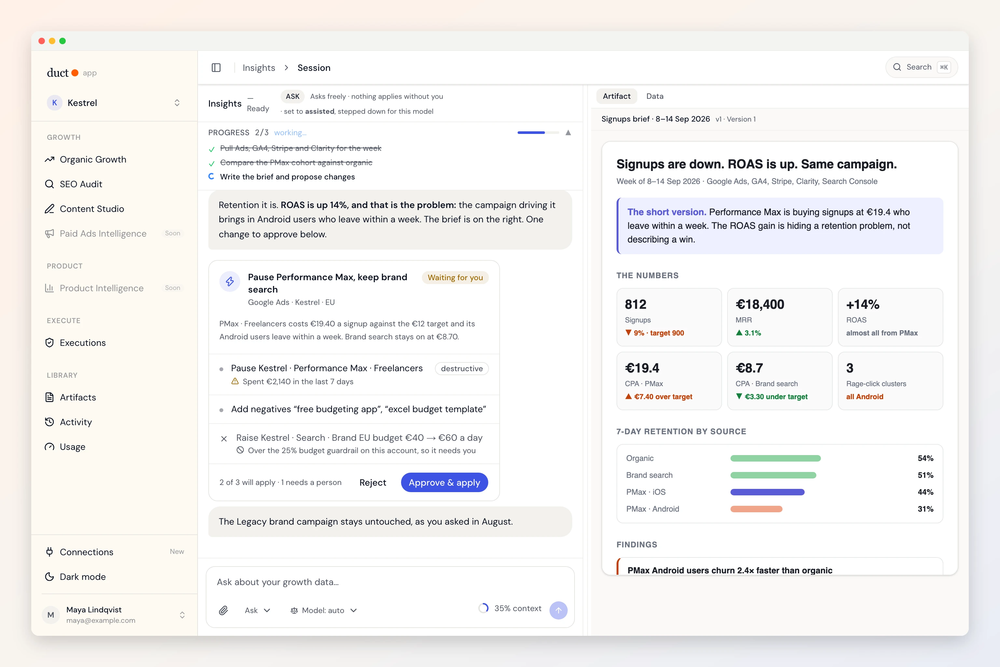
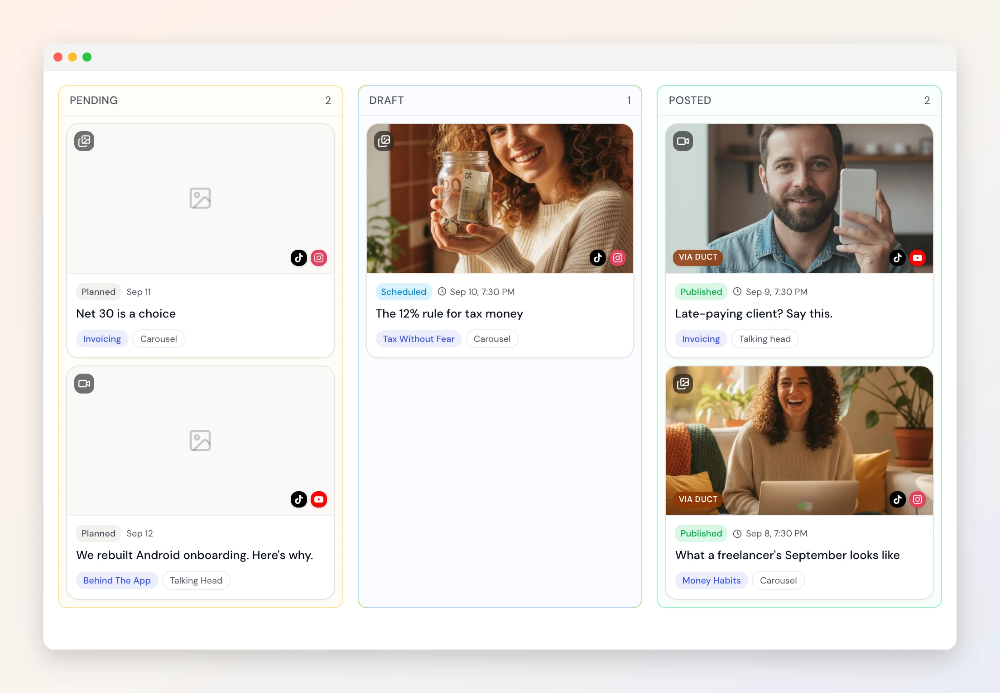
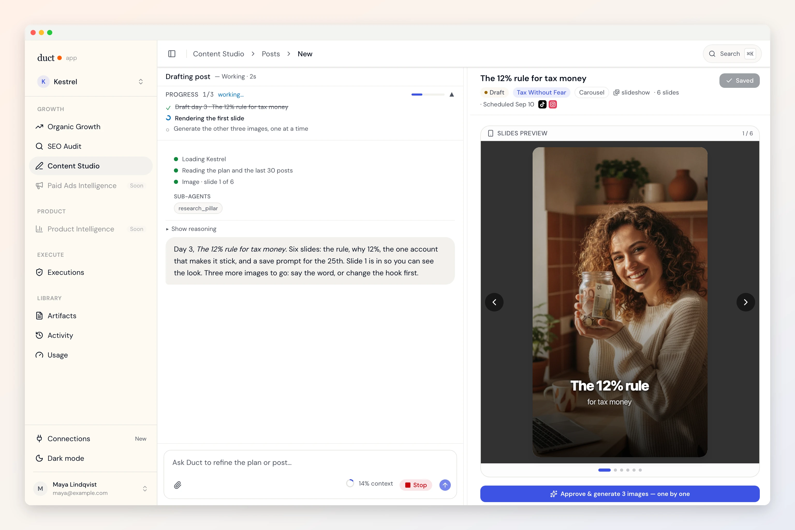
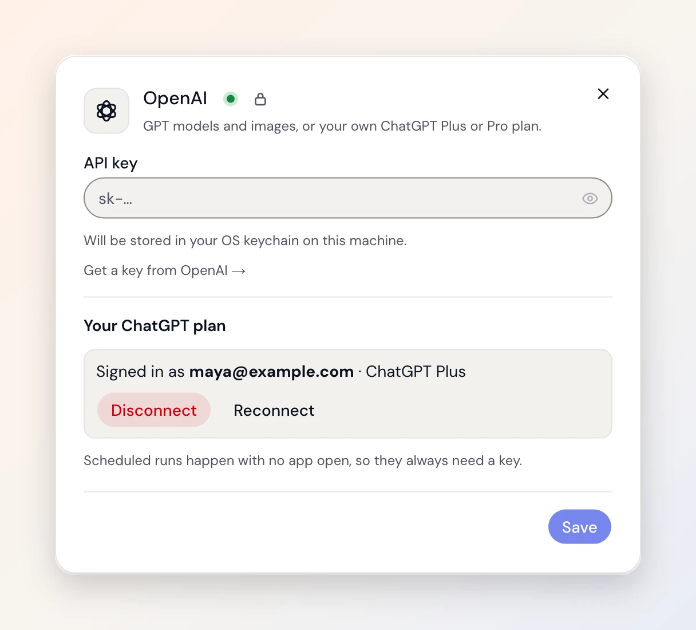
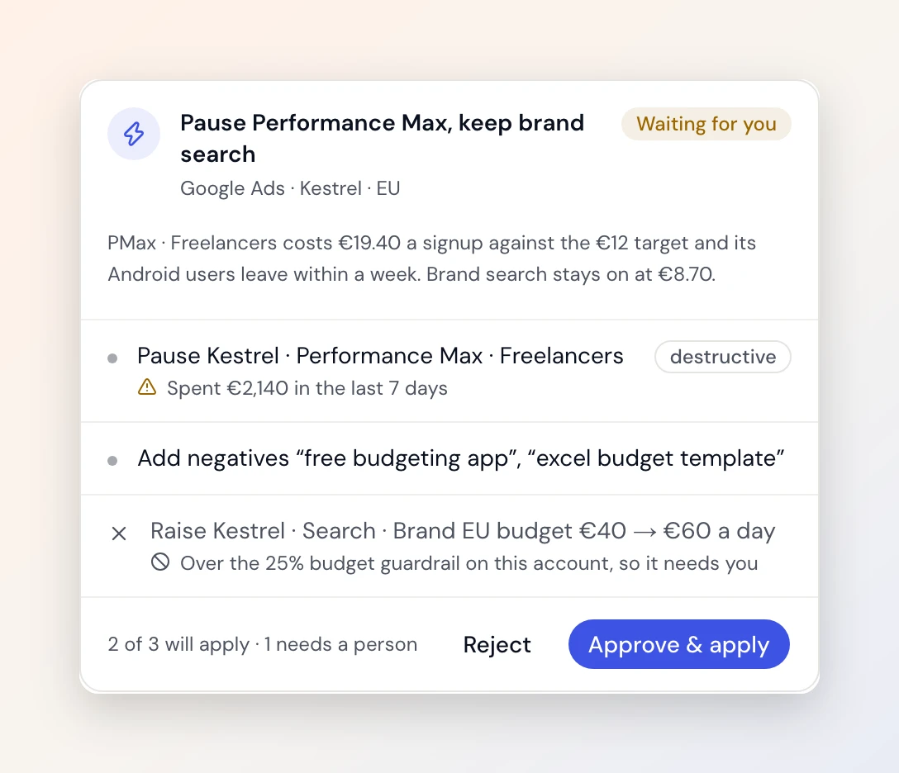
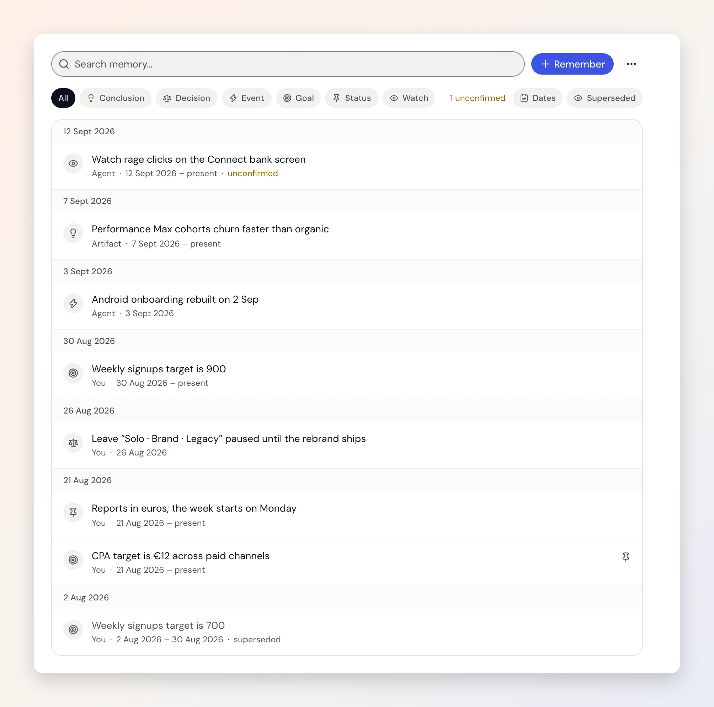
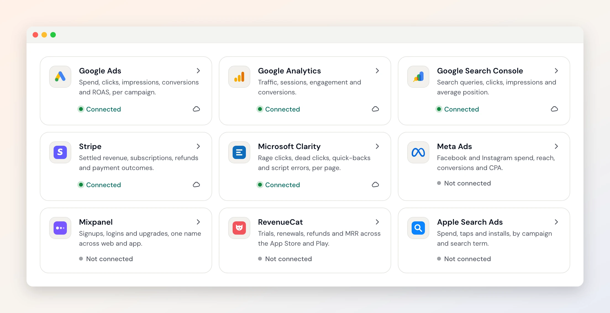

<p align="center">
  
</p>

# Duct

**Reads your whole growth stack. Changes nothing without you.**

Duct is an open-source AI agent for product and growth teams. It connects
Google Ads, GA4, Search Console, Mixpanel, Stripe and seven more, reads across
all of them at once, remembers what it learns about your business, and, with
your approval, changes things in those tools for you. The approve tool does
not exist in the list the model can call; you press the button.

[](LICENSE)
[](.github/workflows/backend.yml)
[](.github/workflows/app.yml)
[](https://getduct.ai/download)

**[⬇️ Download the desktop app](https://getduct.ai/download)** and Duct runs the
service for you; your model keys never leave your machine. Prefer to run every
part of it yourself? [Self-host it](#-self-host-it). Same code, MIT either way.

Free during beta · No credit card · About 10 minutes to connect your tools

---

## 🤖 Three agents, more on the way

**📊 Insights.** Ask "why did signups drop last week" and get an answer that
reads Google Ads, GA4 and Stripe together, not one at a time. The kind of thing
it finds: *ROAS up 14%, but Android 7-day retention down 2.4×. You are paying to
acquire churners.* It pauses to ask when it needs a decision, a verification
sub-agent re-checks every number before it reaches you, and the brief it writes
is saved, versioned and cites its sources.

**🌱 SEO audit.** Paste a URL and Duct crawls the site, reads the technical and
content signals, and hands back a prioritised report. This is the free front
door at [getduct.ai](https://getduct.ai): no account needed to run one.

**🎬 Content Studio.** A plan on a board, a post per card, slides and images
generated for each one, and one click to publish to TikTok, Instagram, LinkedIn,
YouTube, Threads, X, Facebook, Pinterest and Bluesky. Results come back onto the
card, so the next plan learns from the last one.

<p align="center">
  
  
</p>

**Who it is for today:** PMs and growth teams, SEO and content teams, and
performance marketers chasing attribution gaps, budget shifts and creative
fatigue.

**🚧 Coming next:** Sales & RevOps (pipeline risk and conversion signals from
CRM, calls and product usage), E-commerce & DTC (LTV-versus-ROAS blind spots
across Meta Ads, Stripe and RevenueCat), and Customer Success (at-risk accounts
from NPS, usage and support signals). Follow along in
[Issues](https://github.com/5hirish/duct/issues) and at [getduct.ai](https://getduct.ai).

## 🔑 Use your ChatGPT subscription

Sign in with your own ChatGPT plan in the desktop app and Duct runs on it. No
API key, no second bill. Or bring keys for Anthropic, OpenAI, Gemini, xAI or
anything on OpenRouter, and assign three tiers, Heavy, Standard and Light, so
deep analysis and cheap summaries do not pay the same price. Hit a rate limit
and Duct steps down a tier instead of stopping.

<p align="center">
  
</p>

## ✅ It changes things. You approve.

An agent can propose a change and show you a preview; a person applies it.
Pause a campaign, add negative keywords, set a budget or a bid, create a GA4
key event or audience, publish a Tag Manager version, annotate Mixpanel. Every
change set is previewed, checked against guardrails you set, applied only after
approval, and can be rolled back. The agent can propose and inspect. It cannot
approve or apply. That decision lives in code the model never sees, and there
is a test that keeps it that way.

<p align="center">
  
</p>

## 🧠 It remembers

Duct keeps a memory of your business, your projects and the work it has done:
the CPA target, the campaign you told it to ignore (and that you were the one
who said so), the finding from last month's brief. Every fact knows when it was true and what replaced it, so an
answer can say why it believes something. You can read the whole timeline,
correct it, pin what matters, pause it or reset it.

<p align="center">
  
</p>

## 🔌 Connectors, and more every month

Google Ads · Google Analytics 4 · Search Console · Tag Manager · Meta Ads ·
Apple Search Ads · OpenAI Ads · Mixpanel · Microsoft Clarity · GrowthBook ·
Stripe · RevenueCat · HubSpot, with new ones landing as the agents need them.

Google connects with OAuth, read-only unless you grant more; the rest take a key you paste. Credentials
are encrypted at rest, scoped to one project at a time, and Duct tells you
exactly which permissions it has and which it is missing.

<p align="center">
  
</p>

## 👥 Built for a team

Projects hold the context. Invite collaborators, share a report with them by link, and
every brief, audit and plan stays in the project's library, versioned, for the
next person who asks.

## 🖥️ The desktop app

Native on macOS, Windows and Linux. Model keys live in the OS keychain, sign-in
runs in your own browser, updates are signed, and it says hello with a mosaic.
**[Download it](https://getduct.ai/download).**

### 🏠 Self-host it

The same app can be built with the backend inside: SQLite on your disk,
loopback only, no account, nothing leaving the machine. Or run the backend on
your own server:

```bash
git clone https://github.com/5hirish/duct.git && cd duct
make setup
cp backend/.env.example backend/.env.local   # add one model provider key
make serve-backend                            # then, in a second terminal:
make serve-app
```

[CONTRIBUTING.md](CONTRIBUTING.md) has the full setup, and
[desktop/README.md](desktop/README.md) covers the self-host build.

## 🧭 How it is built

Python and FastAPI on the backend, Next.js in the browser, a Tauri shell on the
desktop, one repository. **[docs/architecture.html](docs/architecture.html)**
is the interactive map: open it in a browser, pick the job you came to do, and
it walks you to the files. The
[Duct Doctrine](https://getduct.ai/doctrine) is the short version of what the
project believes, each tenet linked to the code that enforces it.

| Path | What | Read first |
|---|---|---|
| [`backend/`](backend/) | API, agents, connectors, database | [`backend/AGENTS.md`](backend/AGENTS.md) |
| [`app/`](app/) | The product UI | [`app/AGENTS.md`](app/AGENTS.md) |
| [`desktop/`](desktop/) | The native shell | [`desktop/AGENTS.md`](desktop/AGENTS.md) |
| [`site/`](site/) | getduct.ai | [`site/AGENTS.md`](site/AGENTS.md) |
| [`docs/`](docs/) | Engineering records and references | [`docs/README.md`](docs/README.md) |

## 🤝 Contributing

Start with [CONTRIBUTING.md](CONTRIBUTING.md). Not touching code?
[CONTRIBUTOR-PLAYBOOK.md](CONTRIBUTOR-PLAYBOOK.md) is for design feedback,
writing and product proposals. Everyone who helps is credited in
[CONTRIBUTORS.md](CONTRIBUTORS.md). Agent-written contributions are welcome;
the PR template asks where an agent helped so a reviewer knows where to look.
Security issues go to [SECURITY.md](SECURITY.md), never a public issue.

## 💬 Community

Questions and ideas go in [Discussions](https://github.com/5hirish/duct/discussions),
bugs and proposals in [Issues](https://github.com/5hirish/duct/issues). Duct is
built by [Shirish Kadam](https://github.com/5hirish); more at
[shirishkadam.com](https://shirishkadam.com), [@5hirish](https://x.com/5hirish)
and [Ship with AI](https://youtube.com/@5hirish) on YouTube.

## 📄 License

MIT, see [LICENSE](LICENSE), including its exceptions for third-party
documentation under `docs/guides/` and for trademarks.

## 🏛️ Why "Duct"?

The name is Latin. *Ductus*: a leading. It is the same word hiding inside
*aquaeductus*. Rome's aqueducts never made a single drop of water. They carried
it, on gravity alone, from where it was to where people lived, and some of them
are still doing it two thousand years later with no moving parts. That is the
whole job description. Your data already exists. Duct is the channel.

It is also why the app greets you with Roman threshold mosaics instead of
illustrations of robots: a spring-head at the front door (`FONS`), an open
doorway when you start (`SALVE`), a dry basin with two curious pigeons when
there is nothing to show yet (`NIHIL`), an aqueduct with one arch missing when a
connection fails, the Pompeii guard dog when you are not allowed in
(`CAVE·CANEM`), and this one, for when everything is caught up and the water is
running full:

<p align="center">
  
  <br>
  <sub><em>OTIVM.</em> Leisure. The pigeon is asleep. You have reached the end of the README, so you may be too.</sub>
</p>
