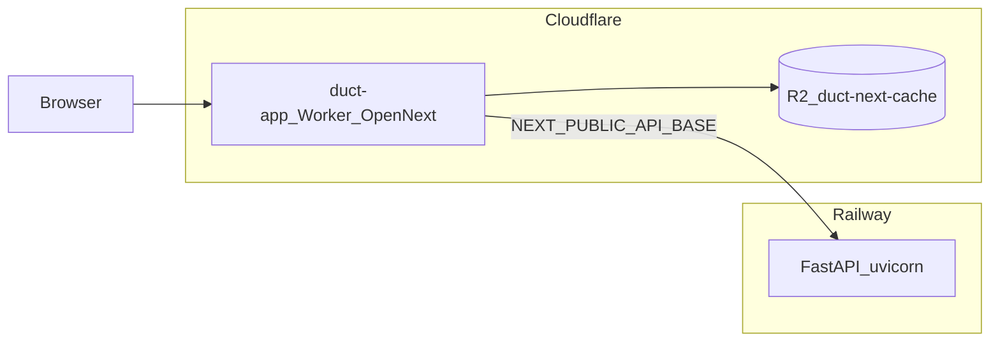

# Deployment: Cloudflare Workers (app) + Railway (backend)

Production shape for this monorepo:

- **[`app/`](../../app/)** — Next.js report viewer on **Cloudflare Workers** via [OpenNext for Cloudflare](https://opennext.js.org/cloudflare) (`@opennextjs/cloudflare`).
- **[`backend/`](../../backend/)** — FastAPI API on **Railway** using **Railpack + Poetry** (no Docker in `backend/` so Railway does not auto-pick a Dockerfile).

Official references:

- Cloudflare Workers + GitHub Actions: [External CI/CD](https://developers.cloudflare.com/workers/wrangler/ci-cd/) → [GitHub Actions](https://developers.cloudflare.com/workers/ci-cd/external-cicd/github-actions/)
- Railway Git deploys: [GitHub autodeploys](https://docs.railway.com/guides/github-autodeploys)
- Railway config as code: [railway.toml / railway.json](https://docs.railway.com/reference/config-as-code)

---

## Architecture



The browser loads the Worker. Client-side API calls use [`app/src/lib/api.js`](../../app/src/lib/api.js): `NEXT_PUBLIC_API_BASE` (default `http://localhost:8000` in dev) must be the **public HTTPS URL** of the Railway service in production.

---

## Repo files (Cloudflare / OpenNext)

Already in the tree:

| File | Role |
|------|------|
| [`app/wrangler.jsonc`](../../app/wrangler.jsonc) | Worker name `duct-app`, `nodejs_compat`, assets binding, self-reference, R2 `NEXT_INC_CACHE_R2_BUCKET` → bucket name `duct-next-cache` |
| [`app/open-next.config.ts`](../../app/open-next.config.ts) | R2 incremental cache for OpenNext |
| [`app/package.json`](../../app/package.json) | `preview:cf`, `deploy:cf` scripts; devDependencies `@opennextjs/cloudflare`, `wrangler` |
| [`app/public/_headers`](../../app/public/_headers) | Long cache for `/_next/static/*` |
| [`.github/workflows/deploy-cloudflare-app.yml`](../../.github/workflows/deploy-cloudflare-app.yml) | Push to `main` (paths under `app/`) or manual dispatch: OpenNext build + `wrangler-action` deploy |
| [`backend/railway.json`](../../backend/railway.json) | Railway config-as-code: `RAILPACK`, watch patterns, uvicorn start, `/health` check |
| [`scripts/bootstrap_env_test.sh`](../../scripts/bootstrap_env_test.sh) | Copy `backend/.env` → `backend/.env.test`, `app/.env.local` → `app/.env.test` (gitignored) |
| [`scripts/push_env_to_github.py`](../../scripts/push_env_to_github.py) | Allowlisted keys from `.env.test` → `gh secret` / `gh variable` |
| [`scripts/push_env_to_railway.py`](../../scripts/push_env_to_railway.py) | Full `backend/.env.test` → Railway variables + redeploy |
| [`scripts/push_app_env_to_cloudflare.py`](../../scripts/push_app_env_to_cloudflare.py) | Load `app/.env.test`, `npm ci`, OpenNext build, `wrangler deploy` |

**R2:** Create bucket `duct-next-cache` in Cloudflare (or change `bucket_name` in `wrangler.jsonc` to match).

---

## Part 1 — Cloudflare Worker (manual or CI)

### One-off / local

From `app/`:

- `npm run preview:cf` — build + `wrangler dev`
- `npm run deploy:cf` — build + deploy

`wrangler login` for local auth.

### Worker environment

Configure in the Cloudflare dashboard (or Wrangler) for the Worker:

| Variable | Purpose |
|----------|---------|
| `NEXT_PUBLIC_API_BASE` | Railway API URL (`https://…`) |
| `NEXT_PUBLIC_APP_URL` | Canonical app URL (`metadataBase` in [`app/src/app/layout.js`](../../app/src/app/layout.js)) |
| `NEXT_PUBLIC_GTM_ID` | Optional. Google Tag Manager container (e.g. `GTM-PKL589SW`); deferred load in [`app/src/lib/analytics-client.js`](../../app/src/lib/analytics-client.js). GA4 and other tags are configured in GTM, not in app code. |

Avoid `NEXT_PUBLIC_DUCT_API_KEY` in production if possible (key is exposed to every browser); prefer a server-side API proxy later ([`app/README.md`](../../app/README.md)).

**Build-time note:** `NEXT_PUBLIC_*` is inlined at **Next/OpenNext build time**. In **GitHub Actions**, pass these as `env` on the build step (or non-secret `vars` in `wrangler.jsonc` for safe values only).

### CORS

[`backend/config.py`](../../backend/config.py) — set `FRONTEND_ORIGIN` (env) to the deployed **Cloudflare app origin** (custom domain or `*.workers.dev`).

---

## Part 2 — Railway (API)

1. New Railway project → deploy from GitHub; **root directory** `backend`.
2. **No `Dockerfile`** under `backend/` — Railway [uses a Dockerfile if present](https://docs.railway.com/reference/config-as-code); without it, **Railpack** + Poetry applies to `pyproject.toml` / `poetry.lock`.
3. **Start command:** `poetry run uvicorn server:app --host 0.0.0.0 --port $PORT` (Railway sets `PORT`).
4. **Python:** match `>=3.12,<3.14` from [`backend/pyproject.toml`](../../backend/pyproject.toml) (use **3.12** in Railway / CI; 3.13 is allowed locally if compatible).

### Railway environment

Mirror [`backend/config.py`](../../backend/config.py): `FRONTEND_ORIGIN`, `DUCT_API_KEY`, Google OAuth and Ads, LLM keys, etc. **`GOOGLE_OAUTH_REDIRECT_URI`** must use the **Railway public host** for the OAuth callback path you expose.

Ephemeral disk: `backend/data/` is not durable for multi-instance production; plan object storage or a DB if you scale beyond one instance.

### `backend/railway.json`

Checked in as [config-as-code](https://docs.railway.com/reference/config-as-code): `RAILPACK` builder, `watchPatterns` for Python and Poetry lockfiles (service root should still be **`backend`** in Railway), start command `poetry run uvicorn server:app --host 0.0.0.0 --port $PORT`, and `healthcheckPath` `/health`.

---

## Part 3 — CI/CD (GitHub)

### Cloudflare: GitHub Actions (implemented)

Workflow: [`.github/workflows/deploy-cloudflare-app.yml`](../../.github/workflows/deploy-cloudflare-app.yml). Uses [`cloudflare/wrangler-action@v3`](https://github.com/cloudflare/wrangler-action). Do **not** also wire the same Worker to Cloudflare dashboard Git Builds, or you risk double deploys.

**Repository secrets** (Settings → Secrets and variables → Actions → Secrets):

| Secret | Purpose |
|--------|---------|
| `CLOUDFLARE_API_TOKEN` | Workers deploy + **R2** for the OpenNext cache bucket |
| `CLOUDFLARE_ACCOUNT_ID` | Account ID ([find in dashboard](https://developers.cloudflare.com/fundamentals/account/find-account-and-zone-ids/)) |

**Repository variables** (Settings → Secrets and variables → Actions → **Variables**):

| Variable | Purpose |
|----------|---------|
| `NEXT_PUBLIC_API_BASE` | Public Railway API URL (`https://…`) — inlined at **build** time |
| `NEXT_PUBLIC_APP_URL` | Canonical Worker or custom domain URL for the app — inlined at **build** time |

Set both variables before the first successful deploy; empty values produce an app build without correct API/metadata URLs.

Triggers: `push` to **`main`** when paths match `app/**` or this workflow file; **`workflow_dispatch`** for manual runs.

Docs: [GitHub Actions for Workers](https://developers.cloudflare.com/workers/ci-cd/external-cicd/github-actions/).

### Railway: Git autodeploy

Connect the repo in Railway; pick the production branch. Optional **Wait for CI** ([doc](https://docs.railway.com/guides/github-autodeploys)) if a workflow runs on `push` to that branch — Railway waits for green GitHub checks.

**Deploy order:** Stand up Railway and a stable URL first, then set Worker `NEXT_PUBLIC_API_BASE` (and rebuild/redeploy the Worker if that URL changes).

### OAuth (Google Cloud Console)

When URLs are final, update authorized **redirect URIs** and **JavaScript origins** to match Railway + Cloudflare hosts.

---

## Local env sync (bootstrap + push)

Use this when you want to refresh **gitignored** `.env.test` files from local dev envs, then push to **GitHub** (CI), **Railway**, and **Cloudflare** without hand-typing the dashboards.

**Never commit** `backend/.env.test`, `app/.env.test`, or `.env.prod`. [`.gitignore`](../../.gitignore) already ignores `.env.*`; do not add `!.env.test`.

### 1. Bootstrap `.env.test` from dev files

From repo root:

```bash
./scripts/bootstrap_env_test.sh
```

- Copies `backend/.env` → `backend/.env.test`
- Copies `app/.env.local` → `app/.env.test`
- Refuses to overwrite unless you pass **`--force`**

Edit the `.env.test` files afterward for production URLs if they differ from local dev.

### 2. Push allowlisted keys to GitHub (Actions)

Requires [`gh`](https://cli.github.com/) and `gh auth login` with permission to set secrets/variables on this repo.

```bash
python3 scripts/push_env_to_github.py
```

- Reads **both** `backend/.env.test` and `app/.env.test` (later file wins on duplicate keys).
- **Secrets** (`gh secret set`): `CLOUDFLARE_API_TOKEN`, `CLOUDFLARE_ACCOUNT_ID`, `NEXT_PUBLIC_DUCT_API_KEY`
- **Variables** (`gh variable set`): every other `NEXT_PUBLIC_*` key present (e.g. `NEXT_PUBLIC_API_BASE`, `NEXT_PUBLIC_APP_URL`)

All other keys (e.g. `DUCT_API_KEY`, Google, LLM) are **not** sent to GitHub.

Use **`--dry-run`** to print what would happen without calling `gh`.

### 3. Push full backend env to Railway

Requires [Railway CLI](https://docs.railway.com/guides/cli) and `railway link` from the **`backend/`** service context.

```bash
python3 scripts/push_env_to_railway.py
```

- Default file: `backend/.env.test` (override with `--file`)
- Sets each key with `railway variable set KEY --stdin --skip-deploys`, then runs **`railway redeploy -y`** (skip redeploy with `--no-redeploy`, preview with `--dry-run`)

### 4. Build and deploy the app to Cloudflare (local)

Requires Node, `wrangler login` (or `CLOUDFLARE_API_TOKEN` in your environment), and the R2 bucket.

```bash
python3 scripts/push_app_env_to_cloudflare.py
```

- Default file: `app/.env.test`
- Runs `npm ci`, `npx opennextjs-cloudflare build`, `npx wrangler deploy` under **`app/`** with env vars from the file merged into the process (so `NEXT_PUBLIC_*` are inlined at build time).

Use **`--dry-run`** to list keys and commands only.

### Suggested order

1. Bootstrap `.env.test`
2. Adjust values for production
3. `push_env_to_railway.py` (API URL stable for `NEXT_PUBLIC_API_BASE`)
4. `push_env_to_github.py` then push `main` or run **Deploy Cloudflare App** workflow (CI build uses GitHub Variables)
5. Either rely on CI for the Worker, or `push_app_env_to_cloudflare.py` for a direct Wrangler deploy from your machine

---

## Out of scope for this stack

**Cloudflare Python Workers** for this FastAPI app: not a fit for `google-ads`, LangChain, and filesystem-backed `data/` without major rework. Keep the API on Railway.

---

## Checklist

- [ ] R2 bucket exists and matches `wrangler.jsonc`
- [ ] Railway service: root `backend`, Railpack, start command, env vars
- [ ] `FRONTEND_ORIGIN` = Cloudflare app URL; `NEXT_PUBLIC_API_BASE` = Railway URL
- [ ] Google OAuth redirect URI matches Railway
- [ ] GitHub secrets + variables for Cloudflare deploy workflow
- [ ] End-to-end: `/`, `/reports`, API calls from deployed app
