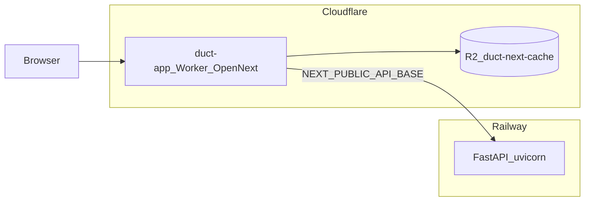

# Deployment: Cloudflare Workers (app) + Railway (backend)

Production shape for this monorepo:

- **[`app/`](../../app/)** — Next.js report viewer on **Cloudflare Workers** via [OpenNext for Cloudflare](https://opennext.js.org/cloudflare) (`@opennextjs/cloudflare`).
- **[`backend/`](../../backend/)** — FastAPI API on **Railway** using **Railpack + Poetry** (no Docker in `backend/` so Railway does not auto-pick a Dockerfile).

Official references:

- Cloudflare Workers Builds (Git): [Builds](https://developers.cloudflare.com/workers/ci-cd/builds/) → [Configuration](https://developers.cloudflare.com/workers/ci-cd/builds/configuration/) (optional: [GitHub Actions](https://developers.cloudflare.com/workers/ci-cd/external-cicd/github-actions/) for external CI)
- Railway Git deploys: [GitHub autodeploys](https://docs.railway.com/guides/github-autodeploys)
- Railway config as code: [railway.toml / railway.json](https://docs.railway.com/reference/config-as-code)

---

## Architecture



The browser loads the Worker. Client-side API calls use [`app/src/lib/api.js`](../../app/src/lib/api.js): `NEXT_PUBLIC_API_BASE` (default `http://localhost:8000` in dev) must be the **public HTTPS URL** of the Railway service in production.

---

## Repo files (Cloudflare / OpenNext)

Already in the tree:

| File | Role |
|------|------|
| [`app/wrangler.jsonc`](../../app/wrangler.jsonc) | Worker name `duct-app`, `nodejs_compat`, assets binding, self-reference, R2 `NEXT_INC_CACHE_R2_BUCKET` → bucket name `duct-next-cache` |
| [`app/open-next.config.ts`](../../app/open-next.config.ts) | R2 incremental cache for OpenNext |
| [`app/package.json`](../../app/package.json) | `preview:cf`, `deploy:cf` scripts; devDependencies `@opennextjs/cloudflare`, `wrangler` |
| [`app/public/_headers`](../../app/public/_headers) | Long cache for `/_next/static/*` |
| Cloudflare **Workers Builds** (dashboard) | Connect Git repo; **root directory** `app`; build `npm ci && npx opennextjs-cloudflare build`; deploy `npx wrangler deploy`; set **build variables** for `NEXT_PUBLIC_*`. Optional [build watch paths](https://developers.cloudflare.com/workers/ci-cd/builds/build-watch-paths/) e.g. `app/**` |
| [`backend/railway.json`](../../backend/railway.json) | Railway config-as-code: `RAILPACK`, watch patterns, uvicorn start, `/health` check |
| [`scripts/bootstrap_env_test.sh`](../../scripts/bootstrap_env_test.sh) | Copy `backend/.env` → `backend/.env.test`, `app/.env.local` → `app/.env.test` (gitignored) |
| [`scripts/push_env_to_github.py`](../../scripts/push_env_to_github.py) | Allowlisted keys from `.env.test` → `gh secret` / `gh variable` |
| [`scripts/push_env_to_railway.py`](../../scripts/push_env_to_railway.py) | Full `backend/.env.test` → Railway variables + redeploy |
| [`scripts/push_app_env_to_cloudflare.py`](../../scripts/push_app_env_to_cloudflare.py) | Load `app/.env.test`, `npm ci`, OpenNext build, `wrangler deploy` |

**R2:** Create bucket `duct-next-cache` in Cloudflare (or change `bucket_name` in `wrangler.jsonc` to match).

---

## Part 1 — Cloudflare Worker (Workers Builds, manual, or local)

### One-off / local

From `app/`:

- `npm run preview:cf` — build + `wrangler dev`
- `npm run deploy:cf` — build + deploy

`wrangler login` for local auth.

### Worker environment

Configure in the Cloudflare dashboard (or Wrangler) for the Worker:

| Variable | Purpose |
|----------|---------|
| `NEXT_PUBLIC_API_BASE` | Railway API URL (`https://…`) |
| `NEXT_PUBLIC_APP_URL` | Canonical app URL (`metadataBase` in [`app/src/app/layout.js`](../../app/src/app/layout.js)). Must be a real absolute URL (e.g. `https://duct-app.youraccount.workers.dev` or your custom domain). Placeholder text like `https://duct-app.<subdomain>.workers.dev` is **invalid** and used to fail the OpenNext build. |
| `NEXT_PUBLIC_GTM_ID` | Optional. Google Tag Manager container (e.g. `GTM-PKL589SW`); deferred load in [`app/src/lib/analytics-client.js`](../../app/src/lib/analytics-client.js). GA4 and other tags are configured in GTM, not in app code. |

Avoid `NEXT_PUBLIC_DUCT_API_KEY` in production if possible (key is exposed to every browser); prefer a server-side API proxy later ([`app/README.md`](../../app/README.md)).

**Build-time note:** `NEXT_PUBLIC_*` is inlined at **Next/OpenNext build time**. With **Workers Builds**, define them under the Worker’s **build variables / secrets** (dashboard), not only runtime vars. Do not commit secrets into `wrangler.jsonc` `vars` for production.

### CORS

[`backend/config.py`](../../backend/config.py) — set `FRONTEND_ORIGIN` (env) to the deployed **Cloudflare app origin** (custom domain or `*.workers.dev`).

---

## Part 2 — Railway (API)

1. New Railway project → deploy from GitHub; **root directory** `backend`.
2. **No `Dockerfile`** under `backend/` — Railway [uses a Dockerfile if present](https://docs.railway.com/reference/config-as-code); without it, **Railpack** + Poetry applies to `pyproject.toml` / `poetry.lock`.
3. **Start command:** `poetry run uvicorn server:app --host 0.0.0.0 --port $PORT` (Railway sets `PORT`).
4. **Python:** match `>=3.12,<3.14` from [`backend/pyproject.toml`](../../backend/pyproject.toml) (use **3.12** in Railway / CI; 3.13 is allowed locally if compatible).

### Railway environment

Mirror [`backend/config.py`](../../backend/config.py): `FRONTEND_ORIGIN`, **`API_PUBLIC_URL`** (public API origin, e.g. `https://api.getduct.ai`), `DUCT_API_KEY`, Google OAuth and Ads, LLM keys, etc. Local dev: the backend loads **`backend/.env`** then **`backend/.env.local`** (later wins). Railway/production variables are the process environment only (no dotenv files on the host unless you add them). If **`GOOGLE_OAUTH_REDIRECT_URI`** / **`GOOGLE_SIGNIN_REDIRECT_URI`** are omitted, they default to `{API_PUBLIC_URL}/auth/google/callback` and `{API_PUBLIC_URL}/auth/signin/google/callback`. Google Cloud **authorized redirect URIs** must list the **full** URLs you use (Google does not accept path-only values). Override the env vars if you need non-default paths.

Ephemeral disk: `backend/data/` is not durable for multi-instance production; plan object storage or a DB if you scale beyond one instance.

### Public API routes (root, health, OpenAPI)

- **`GET /`** — Returns public JSON: `service`, `version`, and `links`. `links.health` is always `/health`. `links.openapi` and `links.docs` appear only when OpenAPI is enabled (see below).
- **`GET /health`** — Used by Railway as `healthcheckPath` in [`backend/railway.json`](../../backend/railway.json).

**OpenAPI / Swagger UI** — Off by default. The app does not register `/openapi.json`, `/docs`, or `/redoc` unless you opt in:

| Variable | Purpose |
|----------|---------|
| `EXPOSE_OPENAPI_DOCS` | Set to `true` to serve OpenAPI and Swagger/ReDoc. Leave unset or `false` in production unless you have a specific need. |

If you enable docs in any shared or public environment, protect them with HTTP Basic auth (otherwise anyone with the URL can read your full route surface):

| Variable | Purpose |
|----------|---------|
| `OPENAPI_DOCS_BASIC_USER` | Optional; default `docs`. Same as **`DUCT_OPENAPI_DOCS_BASIC_USER`** if you prefer a `DUCT_` prefix. |
| `OPENAPI_DOCS_BASIC_PASSWORD` | When non-empty, `/docs`, `/redoc`, `/openapi.json`, and paths under `/docs/` require **HTTP Basic** auth (browser login prompt; `curl -u docs:PASSWORD …`). Uses `secrets.compare_digest` for credentials. Alias: **`DUCT_OPENAPI_DOCS_BASIC_PASSWORD`**. |

**Cloudflare (optional extra layer):** On the API hostname you can add [Cloudflare Access](https://developers.cloudflare.com/cloudflare-one/policies/access/) or WAF/custom rules for `/docs*`, `/redoc*`, and `/openapi.json` (e.g. team login, IP allowlist) in addition to app-level Basic auth.

### `backend/railway.json`

Checked in as [config-as-code](https://docs.railway.com/reference/config-as-code): `RAILPACK` builder, `watchPatterns` for Python and Poetry lockfiles, start command `poetry run uvicorn server:app --host 0.0.0.0 --port $PORT`, and `healthcheckPath` `/health`.

**Replica CPU / memory** can be set in the same file via `deploy.limitOverride.containers` (see [Railway `railway.schema.json`](https://railway.com/railway.schema.json)): `cpu` is a number (vCPU), `memoryBytes` is bytes (e.g. `1073741824` = 1 GiB). The repo pins **`numReplicas`: 1** and **1 GiB** RAM for MVP; raise `memoryBytes` if the process OOMs during heavy reports or LLM calls. Dashboard **Replica Limits** can still apply; config-as-code overrides per Railway’s merge rules—confirm on the deployment detail page which values won.

### Monorepo: Root Directory is required

This repo is a monorepo (`app/`, `backend/`, `site/`, …). Railway must build **only** `backend/` for the API service.

1. Open the **API service** → **Settings**.
2. Set **Root Directory** to **`backend`** (exactly that string).
3. Redeploy.

If **Root Directory** is empty, the build uses the **repository root**. Then:

- Logs may show: `skipping 'railway.json' at 'backend/railway.json' as it is not rooted at a valid path` with `root_dir=`.
- **Railpack** sees the whole tree and may fail with **“could not determine how to build the app”** because there is no single `pyproject.toml` at the repo root.

Per Railway’s [monorepo guide](https://docs.railway.com/guides/monorepo): set the service **root directory** so Railway only uses that folder for the deployment. If you ever keep the service root at the repo root instead, their docs note you may need an **absolute** path to config (e.g. `/backend/railway.toml`) because **“The Railway Config File does not follow the Root Directory path”** in that setup. With **Root Directory = `backend`**, [`backend/railway.json`](../../backend/railway.json) is at the root of the build context and should be detected without extra path settings.

### Watch paths (when to redeploy the API)

[Watch paths](https://docs.railway.com/builds/build-configuration#configure-watch-paths) are **gitignore-style** patterns. Important: **even if Root Directory is `backend`, patterns are still evaluated from the repository root** (`/` in their docs = repo root). So use a **`backend/`** prefix, not bare `**/*.py` (that would match Python files anywhere in the monorepo and redeploy the API on unrelated changes).

Recommended patterns (one per line in the Railway UI **Watch Paths** field, or use [`backend/railway.json`](../../backend/railway.json) `build.watchPatterns`):

```gitignore
backend/**/*.py
backend/pyproject.toml
backend/poetry.lock
backend/railway.json
```

If you leave Watch Paths **empty**, every push to the connected branch can trigger a deploy (behavior depends on Railway’s defaults). Scoped patterns avoid redeploying the API when only `app/`, `site/`, or docs change.

---

## Part 3 — CI/CD

### Cloudflare: Workers Builds (Git) — primary app deploy

The Next.js Worker is built and deployed from **Cloudflare** when you push to the connected branch (see [Workers Builds](https://developers.cloudflare.com/workers/ci-cd/builds/)). Do **not** re-add a second pipeline (e.g. GitHub Actions `wrangler deploy`) for the same Worker, or you risk **double deploys**.

**In the Worker → Settings → Builds (and build variables):**

| Setting | Typical value |
|---------|----------------|
| Root directory | `app` |
| Build command | `npm ci && npx opennextjs-cloudflare build` |
| Deploy command | `npx wrangler deploy` |
| Build variables | `NEXT_PUBLIC_API_BASE`, `NEXT_PUBLIC_APP_URL`, optional `NEXT_PUBLIC_GTM_ID` |

Workers Builds can use an auto-created API token for deploy; R2 for OpenNext cache must be allowed for that token.

**Optional:** [Build watch paths](https://developers.cloudflare.com/workers/ci-cd/builds/build-watch-paths/) (e.g. `app/**`) so pushes that only touch `backend/` or `site/` do not rebuild the app.

**Optional GitHub mirror:** [`scripts/push_env_to_github.py`](../../scripts/push_env_to_github.py) can still push `NEXT_PUBLIC_*` to repo **Variables** for documentation or other automation; it is **not** required for Workers Builds.

### Railway: Git autodeploy

Connect the repo in Railway; pick the production branch. Optional **Wait for CI** ([doc](https://docs.railway.com/guides/github-autodeploys)) if a workflow runs on `push` to that branch — Railway waits for green GitHub checks.

**Deploy order:** Stand up Railway and a stable URL first, then set Worker `NEXT_PUBLIC_API_BASE` (and rebuild/redeploy the Worker if that URL changes).

### OAuth (Google Cloud Console)

When URLs are final, update authorized **redirect URIs** and **JavaScript origins** to match Railway + Cloudflare hosts.

---

## Local env sync (bootstrap + push)

Use this when you want to refresh **gitignored** `.env.test` files from local dev envs, then push to **GitHub** (optional vars), **Railway**, and **Cloudflare** (local Wrangler or dashboard) without retyping everything.

**Never commit** `backend/.env.test`, `app/.env.test`, or `.env.prod`. [`.gitignore`](../../.gitignore) already ignores `.env.*`; do not add `!.env.test`.

### 1. Bootstrap `.env.test` from dev files

From repo root:

```bash
./scripts/bootstrap_env_test.sh
```

- Copies `backend/.env` → `backend/.env.test`
- Copies `app/.env.local` → `app/.env.test`
- Refuses to overwrite unless you pass **`--force`**

Edit the `.env.test` files afterward for production URLs if they differ from local dev.

### 2. Push allowlisted keys to GitHub (optional)

Requires [`gh`](https://cli.github.com/) and `gh auth login` with permission to set secrets/variables on this repo.

```bash
python3 scripts/push_env_to_github.py
```

- Reads **both** `backend/.env.test` and `app/.env.test` (later file wins on duplicate keys).
- **Secrets** (`gh secret set`): `CLOUDFLARE_API_TOKEN`, `CLOUDFLARE_ACCOUNT_ID`, `NEXT_PUBLIC_DUCT_API_KEY`
- **Variables** (`gh variable set`): every other `NEXT_PUBLIC_*` key present (e.g. `NEXT_PUBLIC_API_BASE`, `NEXT_PUBLIC_APP_URL`)

All other keys (e.g. `DUCT_API_KEY`, Google, LLM) are **not** sent to GitHub.

Use **`--dry-run`** to print what would happen without calling `gh`.

### 3. Push full backend env to Railway

Requires [Railway CLI](https://docs.railway.com/guides/cli) and `railway link` from the **`backend/`** service context.

```bash
python3 scripts/push_env_to_railway.py
```

- Default file: `backend/.env.test` (override with `--file`)
- Sets each key with `railway variable set KEY --stdin --skip-deploys`, then runs **`railway redeploy -y`** (skip redeploy with `--no-redeploy`, preview with `--dry-run`)

### 4. Build and deploy the app to Cloudflare (local)

Requires Node, `wrangler login` (or `CLOUDFLARE_API_TOKEN` in your environment), and the R2 bucket.

```bash
python3 scripts/push_app_env_to_cloudflare.py
```

- Default file: `app/.env.test`
- Runs `npm ci`, `npx opennextjs-cloudflare build`, `npx wrangler deploy` under **`app/`** with env vars from the file merged into the process (so `NEXT_PUBLIC_*` are inlined at build time).

Use **`--dry-run`** to list keys and commands only.

### Suggested order

1. Bootstrap `.env.test`
2. Adjust values for production
3. `push_env_to_railway.py` (API URL stable for `NEXT_PUBLIC_API_BASE`)
4. Set **`NEXT_PUBLIC_*`** on the Worker’s **Workers Builds** build variables in the Cloudflare dashboard (or run `push_env_to_github.py` only if you still want repo Variables as a mirror)
5. Push `main` to trigger **Workers Builds**, or run `push_app_env_to_cloudflare.py` for a direct Wrangler deploy from your machine

---

## Out of scope for this stack

**Cloudflare Python Workers** for this FastAPI app: not a fit for `google-ads`, LangChain, and filesystem-backed `data/` without major rework. Keep the API on Railway.

---

## Checklist

- [ ] R2 bucket exists and matches `wrangler.jsonc`
- [ ] Railway service: root `backend`, Railpack, start command, env vars
- [ ] `FRONTEND_ORIGIN` = Cloudflare app URL; `NEXT_PUBLIC_API_BASE` = Railway URL
- [ ] Google OAuth redirect URI matches Railway
- [ ] OpenAPI: production should leave **`EXPOSE_OPENAPI_DOCS` unset/false**; if you ever enable it, set a strong **`OPENAPI_DOCS_BASIC_PASSWORD`** (and optionally Cloudflare Access on those paths)
- [ ] Cloudflare Workers Builds: repo connected, root `app`, build/deploy commands, build variables for `NEXT_PUBLIC_*`
- [ ] End-to-end: Worker `/`, `/reports`, and API calls from the deployed app; optional sanity check **`GET`** API root (`/`) returns JSON and **`GET /health`** is `200`
