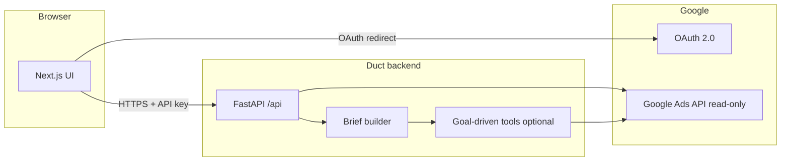
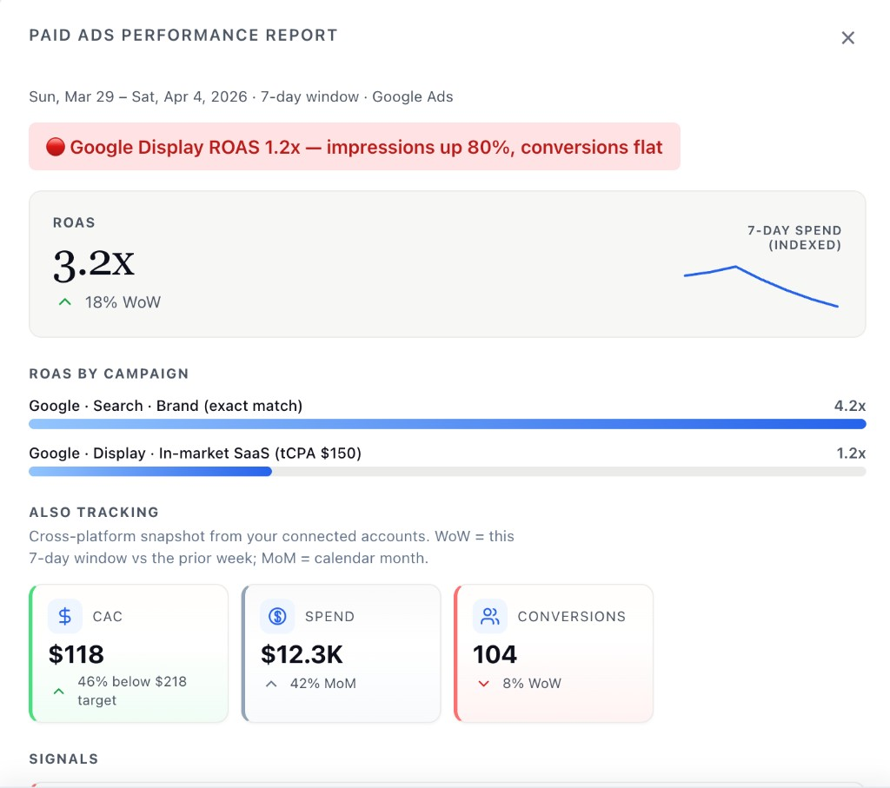

# Google Ads API — Tool design document

**Product:** Duct (https://getduct.ai)  
**Document version:** 1.0  
**Last updated:** April 2026  

This document follows the structure Google’s token application materials use as a reference. **Word copies (with embedded prototype image):** [`google-ads-api-tool-design-document.docx`](google-ads-api-tool-design-document.docx) (recommended) and [`google-ads-api-tool-design-document.doc`](google-ads-api-tool-design-document.doc) (legacy Word format for uploaders that require `.doc`). If your tool is **externally accessible**, include **screenshots or mock-ups** (see §7).

---

## 1. Company name

**Duct** (public site: https://getduct.ai)

*If your legal entity differs (e.g. “Alleviate Lab LLC”), add it here in parentheses.*

---

## 2. Business model

Duct is a **software product** that helps advertisers understand **Google Ads performance** through **structured reports** and **goal-oriented analysis** (for example: efficiency, ROAS, scaling, or spend audits). The product is developed and operated by our company; we are **not** a traditional agency managing third-party ad accounts as the primary business, though **end users** (including marketers and agencies) may use Duct with **their own** Google Ads accounts where permitted.

We use the Google Ads API **only to read** performance and account metadata that the authenticated user is authorized to access. We **do not** use the API to **create Google Ads accounts**, **create or edit campaigns or ads**, or to run **Keyword Planner** as a service.

---

## 3. Tool access / use

**Who uses the tool**

- **Primary:** Authenticated users (internal team during development; **external customers** as the product matures) who **connect their Google Ads account via OAuth** and **run reports on demand**.
- **Access model:** Users initiate a **report generation** flow in the web app: they choose data sources (Google Ads), select **account** (when multiple are accessible), **analysis goal**, optional **business context**, and **date range**. The backend calls the Google Ads API with that user’s **refresh token** for that session/request and returns a **JSON brief** rendered in the UI. Users may **save** reports for local viewing in the app (e.g. browser storage for demos); production deployments may persist reports according to our data policy.

**What we do *not* do (today)**

- We **do not** expose our Google Ads developer token to arbitrary third-party tools.
- We **do not** run a **scheduled batch job** (e.g. hourly) that mutates Google Ads entities for inventory or stock status. *Unlike sample applications that sync inventory to pause ads, Duct’s current implementation is **read-only** toward Google Ads.*
- We **do not** grant agency partners **direct login** to our app unless they are normal product users; any sharing of **exported** insights (PDF/screenshot/email) is outside the API tool’s access boundary.

*Adjust the “internal vs external” sentences above to match exactly what you selected on the application (internal only, external, or both).*

---

## 4. Tool design

**Architecture (high level)**

1. **Web client (Next.js)** — Pages for **connections** (OAuth), **generate report** (wizard: sources → configuration → review → generate), and **report viewing**.
2. **Application backend (FastAPI)** — Serves REST APIs under `/api/…`, validates **API key** on protected routes, performs **OAuth** redirects for Google (browser flow), and orchestrates **fetch → brief → optional LLM synthesis**.
3. **Google Ads API** — **Read-only** access using `GoogleAdsClient` with **developer token**, **OAuth client id/secret**, user **refresh token**, and optional **`login_customer_id`** (MCC) when listing or querying client accounts under a manager.

**Data flow**

- User completes **Google OAuth** (scope: `https://www.googleapis.com/auth/adwords`). Refresh token is stored **in the browser** for the demo-style flow (`sessionStorage`) and sent to our backend only when requesting account list or generation; **production** should move to server-side token storage tied to user identity.
- **Account listing:** Backend calls **`CustomerService.list_accessible_customers`**, then **`GoogleAdsService.search_stream`** with a small **`customer`** query to attach names and currency.
- **Reporting:** Backend runs **GAQL** via **`GoogleAdsService.search_stream`** over user-selected **date ranges**. Campaign-level metrics are always fetched; **additional** slices (e.g. search terms, device, geography, ad group) are invoked **when the analysis agent** selects those tools for the user’s **goal**.
- **Brief + synthesis:** Raw aggregates are turned into a **typed brief** (deterministic structure). An **LLM** may add narrative synthesis; **no LLM output** is written back to Google Ads.

**User interface**

- **Reporting** is interactive in the browser (scrollable report, optional synthesis sections).
- **PDF export** is *not* required for API compliance; if you add it later, describe it here. *Current MVP focuses on on-screen report and local save.*

---

## 5. API services called (read-only)

All access is **read** via **`GoogleAdsService.search_stream`** (GAQL) and **`CustomerService.list_accessible_customers`**. We **do not** call **mutate** services (no `CampaignService.mutate`, `AdGroupAdService`, `KeywordPlanIdeaService`, etc.).

| Purpose | Google Ads API usage |
|--------|----------------------|
| List accounts user can access | `CustomerService.list_accessible_customers`; then `GoogleAdsService.search_stream` on **`customer`** (id, name, currency, time zone, manager flag). |
| Campaign performance | `GoogleAdsService.search_stream` — GAQL **`FROM campaign`** with `segments.date`, metrics (clicks, impressions, cost, conversions, conversion value), `campaign.advertising_channel_type`. Excludes `REMOVED` campaigns. |
| Search terms (top by spend, capped) | `GoogleAdsService.search_stream` — **`FROM search_term_view`**. |
| Device segmentation | `GoogleAdsService.search_stream` — **`FROM campaign`** with `segments.device`. |
| Geography | `GoogleAdsService.search_stream` — **`FROM geographic_view`**. |
| Ad group rollups | `GoogleAdsService.search_stream` — **`FROM ad_group`**. |

**Campaign types:** We do **not** filter by channel in code; any **non-removed** campaign returned by reporting is in scope (Search, Performance Max, Display, Shopping, Video, etc., per Google’s classification).

---

## 6. Security and compliance (summary)

- **Transport:** HTTPS between client and backend.
- **Authentication to our API:** `X-API-Key` on `/api/...` routes (except health and OAuth redirect endpoints as configured).
- **Secrets:** Developer token, OAuth client secret, and LLM keys are **environment variables** on the server, not committed to source control.
- **Logging:** We avoid logging full OAuth refresh tokens; operational logs may record **customer id** and **errors** for support.
- **Token handling:** Align deployed behavior with Google’s OAuth and Ads API policies; prefer **server-stored refresh tokens** per end-user account for production.

---

## 7. Tool mockups / screenshots

**Required for externally accessible tools:** embed **3–6** screenshots or mock-ups in the PDF. Below is a **prototype of the primary reporting UI**; add live captures of the connection and generate flows when exporting if you want a fuller set.

### 7.1 Prototype — Paid Ads Performance Report (demo)

This mock-up shows how users view **Google Ads** performance in the product: date window, headline **ROAS** with week-over-week context, **7-day spend** sparkline, **ROAS by campaign** bars (Search vs Display called out), **CAC / Spend / Conversions** cards with target and period comparisons, and a **signals** area for notable issues (e.g. Display ROAS vs impressions).

*Figure: Prototype report surface. Production UI is data-driven from API-backed briefs; layout and metrics match this experience.*

### 7.2 Additional captures (optional for PDF)

| # | Screen | Route / area |
|---|--------|----------------|
| 1 | Connections — Google Ads connect / status | `/connections` |
| 2 | Generate — data sources step | `/generate` step 1 |
| 3 | Generate — account + goal + date range | `/generate` step 2 |
| 4 | Generate — review before run | `/generate` step 3 |
| 5 | In-progress / generating state | `/generate` during API call |
| 6 | Live report (optional second shot) | `/generate` after success or `/reports/[slug]` |

When building the PDF for Google, **paste or embed** the PNG above (and any extras) so reviewers do not depend on Markdown rendering.

---

## 8. Declaration alignment (checklist for your application)

Use the same answers on the form:

- **Capabilities:** **Reporting** (read-only). Not: account/campaign creation or management via API; not Keyword Planner; not App Conversion Tracking / Remarketing API unless you add them.
- **Token use with someone else’s tool:** **No** (token is for Duct’s own backend).
- **Campaign types:** List major types or state “all types returned in campaign reporting.”

---

*End of document.*
