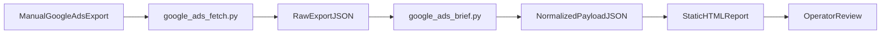

# Duct — Google Ads MVP Plan

**Version:** v0.1
**Status:** Approved for implementation
**Date:** April 2026

> This document defines the smallest useful MVP for `for-paid-ads`: a lightweight, semi-manual Google Ads reporting flow that produces a decision-ready web report. It is intentionally narrow so the team can shape the report format before adding more tools or automation.

---

## Goal

Build a lightweight reporting MVP for paid ads that starts with **Google Ads only** and answers three questions clearly:

1. What changed this period?
2. What likely matters?
3. What should the operator do next?

The product surface is a **single static HTML report** generated from a normalized JSON payload. The report is operator-first, not customer-self-serve.

---

## MVP Principles

- **One source first.** Google Ads only. No GA4, Meta, LinkedIn, Clarity, or CRM joins yet.
- **Manual-friendly.** The workflow must work with manually exported Google Ads data before any API/auth complexity.
- **Structured before smart.** Normalize data into a stable payload before any narrative synthesis.
- **Report, not dashboard.** One strong brief is more valuable than a broad but shallow interface.
- **Easy to reshape.** Copy, scoring, and layout should be tweakable without changing ingestion logic.

---

## MVP Scope

### Included

- Google Ads campaign-level reporting
- Optional ad-group granularity when available
- Fixed comparison windows:
  - last 7 days
  - previous 7 days
  - last 30 days
- Core metrics:
  - spend
  - impressions
  - clicks
  - CTR
  - CPC
  - conversions
  - cost per conversion
  - conversion value
  - ROAS
- Output sections:
  - account summary
  - period comparison
  - campaign table
  - wins
  - risks
  - recommended actions
  - short narrative summary

### Explicitly out of scope

- Cross-platform intelligence
- Real-time anomaly alerts
- User onboarding or OAuth setup
- Live hosted app/dashboard
- Scheduling or background jobs
- Customer-facing permissions/auth

---

## Product Surface

The first MVP output is a static HTML report intended for internal review or pilot delivery.

### Why HTML first

- Fast to iterate
- Easy to share
- Easy to inspect visually
- Matches Duct's core product philosophy: a delivered brief, not a dashboard to operate

The report should feel like a concise analyst memo, not a BI tool.

---

## Operator Workflow

### MVP sequence

1. Export campaign performance data from Google Ads.
2. Convert the export into a consistent raw JSON file.
3. Normalize the raw rows into a stable payload.
4. Generate structured findings and recommended actions.
5. Render a static HTML report for review.

---

## File Layout

| File | Purpose |
|---|---|
| `docs/mvp/google-ads-mvp-plan.md` | Product + engineering plan for this MVP slice |
| `backend/agents/reporter/prompts.py` | Synthesis system/user prompts (LangChain + Gemini) |
| `backend/service/google/schema.py` | Typed brief payload (`StrEnum`s + dataclasses) |
| `backend/service/google/brief.py` | Normalize raw rows → brief; optional Gemini synthesis |
| `backend/service/google/fetch.py` | Google Ads API → raw campaign JSON |
| `backend/data/google_ads/raw/demo_raw_payload.json` | Static demo raw input |
| `backend/data/google_ads/google-ads-report.json` | Example normalized brief JSON (app demo list) |
| `backend/data/google_ads/generated/` | API-persisted brief JSON |
| `app/src/components/GoogleAdsReport.js` | Renders brief JSON in the Next.js app |

---

## Data Contract

The normalized payload is the core product interface. Everything else hangs off it.

### Required top-level sections

- `account_summary`
- `period_comparison`
- `campaigns`
- `highlights`
- `risks`
- `recommended_actions`
- `source_metadata`

### Why this matters

This contract makes the MVP extensible without rework:

- Meta and LinkedIn can later add more campaign objects
- GA4 can later enrich quality or downstream conversion fields
- Clarity can later attach evidence to findings
- CRM data can later influence action priority and confidence

The renderer should depend on the normalized contract, not on raw Google Ads fields.

---

## Finding Model

Every surfaced insight should follow the same shape:

- **type**: `win`, `risk`, or `watch`
- **title**: short operator-readable statement
- **evidence**: 1-3 concrete facts from the source data
- **impact**: why it matters commercially
- **recommended_action**: what to do next
- **confidence**: low, medium, high

This model is intentionally reusable for later cross-tool synthesis.

---

## Report Sections

The HTML report should include:

1. **Executive summary**
   - one short paragraph
   - one overall verdict
2. **Account KPIs**
   - spend, conversions, CPA, ROAS, conversion value
3. **Period changes**
   - current vs previous 7 days
4. **Top wins**
   - campaigns outperforming baseline
5. **Top risks**
   - campaigns wasting spend, declining CTR, worsening CPA, low ROAS
6. **Recommended actions**
   - scale, monitor, pause, refresh creative, refine query/theme targeting
7. **Campaign table**
   - campaign metrics plus recommended action
8. **Source metadata**
   - export date, lookback windows, source file

---

## Build Sequence

### Phase 1 — Documentation and contract

- Finalize this MVP document
- Define the typed schema
- Define the prompt template and report structure

### Phase 2 — Raw export ingestion

- Accept a manual Google Ads export
- Support CSV first, JSON optional
- Convert raw rows into a consistent intermediate JSON file

### Phase 3 — Normalization and scoring

- Aggregate account totals
- Compute period deltas
- Rank campaigns
- Generate deterministic recommendations from simple rules

### Phase 4 — Rendering

- Render a static HTML report from the normalized payload
- Save the normalized payload alongside the report for debugging

### Phase 5 — Validation

- Run the flow on 2-3 realistic sample exports
- Refine the schema and report language
- Only then consider adding another source

---

## Validation Criteria

The MVP is successful when:

- one account can generate a readable report end to end
- the report surfaces at least 3 useful, specific findings
- a human can quickly decide which campaigns to scale, monitor, or cut
- the payload shape is good enough to accept future enrichment from other tools

---

## Expansion Points

These are intentional hooks for later combined intelligence.

### Future source additions

- **Meta Ads / LinkedIn Ads**
  - add more rows to the same `campaigns` collection
  - compare platform efficiency inside one report
- **GA4**
  - add landing-page and downstream conversion quality evidence
- **Microsoft Clarity**
  - add session-friction evidence to explain inefficient campaigns
- **CRM / revenue source**
  - replace proxy efficiency with actual pipeline or revenue quality

### Schema design rule

New sources should enrich:

- `campaigns[*].evidence`
- `highlights[*].evidence`
- `risks[*].evidence`
- `recommended_actions[*].evidence`

They should not require a new report renderer.

---

## What Not To Build Yet

- no app shell
- no login
- no scheduler
- no webhook alerts
- no warehouse
- no OAuth UX
- no multi-touch attribution model

The fastest route to learning is a single report artifact with a strong schema underneath it.
