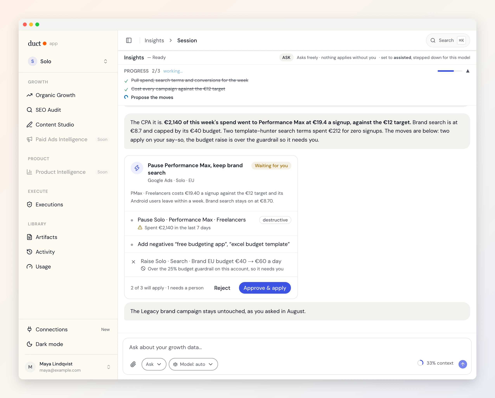

# Duct Site — agent instructions

Static marketing site for [getduct.ai](https://getduct.ai). Pure HTML/CSS/JS.

## Site strategy

Three content types, three jobs:
- **Landing pages** (`for-*.html`) — paid ad experiments. Each page targets a specific audience or solution angle. Fast to create, easy to A/B by URL. Goal: validate conversion before investing in a channel or audience.
- **Blog** (`blog/posts/`) — organic SEO. Written for keyword clusters, not just announcements. Goal: compound traffic from search.
- **Changelog** (`changelog/`) — proof the project moves, for the visitor deciding whether to install. Written for people who use Duct, not for the people who built it. Goal: convert that hesitation, and give search and answer engines something current to cite.

When adding either, ask: *what's the hypothesis being tested?* Put it in a `<!-- EXPERIMENT: ... -->` comment near the top of `<body>`.

**[`DESIGN.md`](DESIGN.md) is the design & voice companion to this file** —
the visual system as built (tokens, signature moves, section rhythm), the
accent-variant rule, the contrast rules for the brand orange, the copy voice
codified from the site's best lines, landing-page craft, and a
close-on-touch gap list. This file stays the home of the mechanical rules CI
enforces. Read both before building a page.

## What the desktop app actually is (read before writing about it)

**The app people download is a thin shell that talks to the hosted API.** It
ships no backend: `bundle.externalBin` and `bundle.resources` are empty in
`desktop/src-tauri/tauri.conf.json`, so `sidecar::is_available` is false, the
web app never repoints its API base, and projects, connector authorisations and
uploads live in Duct's cloud. A *self-host* build restores `bundle.resources`,
bundles the FastAPI backend, and runs everything locally — same binary, runtime
probe, different bundle. See [`desktop/AGENTS.md`](../desktop/AGENTS.md).

This paragraph exists because the site got it backwards twice: a changelog
entry and a privacy-policy section both described the self-host build as if it
were the download. Copy that says "your data stays on your machine" is true of
a build almost nobody runs, and false of the one on the download page.

What is true of the downloaded app, and safe to write:
- **Model API keys stay in the OS keychain** and are sent with a request when a
  job runs. They are never stored server-side — the "remember this key" path is
  suppressed in the desktop shell (`app/src/components/connections/ProviderCard.jsx`).
- **Connector authorisations are stored encrypted** in Duct's database, not on
  the device.
- **"Nothing leaves your machine" is false** — the shell loads `app.getduct.ai`,
  which carries analytics and error reporting.

## Stack constraints

- **NO build tools.** No npm, Vite, Webpack, Rollup, or package manager setup.
- No frameworks (React, Vue, Astro, Alpine, etc.).
- JavaScript should stay vanilla and ES5-compatible where practical.

## Local dev

```bash
python3 -m http.server 8090 --directory site
```

Then open `http://localhost:8090/`.

For Cloudflare-style routing (extensionless URLs), use `python3 dev_server.py
--port 8090` from inside `site/` — the VS Code task **Serve site on :8090** and
the Zed task **Site: dev server (:8090)** both do exactly that. Only one process can bind 8090; `Address already in use` means a
previous `dev_server.py` is still running, so stop it rather than picking
another port (the tests assume 8090).

## URL → file mapping

| Production URL | File |
|---|---|
| `https://getduct.ai/` | `site/index.html` |
| `https://getduct.ai/for-product-intelligence` | `site/for-product-intelligence.html` |
| `https://getduct.ai/for-organic-growth` | `site/for-organic-growth.html` |
| `https://getduct.ai/for-paid-ads` | `site/for-paid-ads.html` |
| `https://getduct.ai/doctrine` | `site/doctrine.html` |
| `https://getduct.ai/blog/` | `site/blog/index.html` |
| `https://getduct.ai/blog/<slug>` | `site/blog/<slug>.html` (**generated**) |
| `https://getduct.ai/blog/post?slug=SLUG` | `site/blog/post.html` (redirect shim, noindex) |
| `https://getduct.ai/changelog/` | `site/changelog/index.html` |
| `https://getduct.ai/changelog/YYYY` | `site/changelog/YYYY.html` (year archive, created at rollover) |
| `https://getduct.ai/<lang>/…` | `site/<lang>/…` (**generated** by `scripts/build_site_i18n.py`; `es`, `pt-br`, `de`, `ja`) |

## Shared assets

| File | Purpose |
|---|---|
| `site/assets/duct.css` | All brand styles |
| `site/assets/duct.js` | Consent gate + GTM init, scroll reveal, nav shadow |
| `site/assets/duct-download.js` | On `/download` only: upgrades `[data-duct-download]` CTAs to the visitor's installer and fetches the release version. Everywhere else those CTAs stay links to `/download`. |
| `site/assets/config.js` | `DUCT_CONFIG.gtm` only |
| `site/assets/icons.svg` | The icon sprite (Lucide, ISC), generated by `scripts/build_site_icons.py` |
| `site/assets/art/*.webp` | The app's Roman mosaic threshold panels, copied from `app/public/art/mosaic/` |
| `site/assets/media/*.webp` | Product shots from `docs/assets/readme/`, made by `scripts/shots/shoot.mjs`; their `-768`/`-1536` variants by `scripts/build_media_variants.mjs` |
| `site/assets/media/demo*.{mp4,webm}` | The launch film and its 720px phone cut, published by `design/motion/publish-media.mjs` |

- Inside `site/` HTML files, root-level pages use `assets/`.
- Blog files under `site/blog/` use `../assets/`.
- **`404.html` is the exception: every path in it is root-absolute** (`/assets/…`).
  Cloudflare Pages serves that one file at whatever URL missed, so a relative
  `assets/duct.css` resolves to `/blog/assets/duct.css` on `/blog/anything` and
  the page renders as unstyled black-on-white text. `tests/e2e/site-smoke.spec.js`
  fetches a nested miss and fails if any subresource 404s.
- `config.js` must load before `duct.js`.
- **Below 860px the bar keeps the GitHub mark and the Download pill beside
  the menu button.** `duct.js` builds that `.nav-actions` cluster from clones
  of the bar's own links when it builds the drawer, so every nav partial gets
  it and the platform label and star count still land through the same
  `data-duct-*` hooks. A phone visitor used to have to open the drawer to
  find either action, with the hero's buttons a screen below. The cluster is
  `display: none` wherever `.nav-links` shows, so the desktop and iPad
  landscape bars never carry two of anything; the drawer keeps its own
  Download row because a menu should end in the action.

## Icons, art and product shots

There are no emoji on the site and no icon font. Every icon is one `<use>` of
the sprite:

```html
<svg class="ic" aria-hidden="true"><use href="/assets/icons.svg#megaphone"/></svg>
```

`.ic` is `1em` and `currentColor`, so an icon takes the size and colour of its
container. To add an icon, add its Lucide name to `ICONS` in
`scripts/build_site_icons.py` and run the script; never paste an SVG path into
a page, and never hand-edit the sprite. The `href` is root-absolute on purpose
so the same markup works from `blog/`, `tools/` and `404.html`.

Illustration is the app's mosaic panels (`assets/art/`, the rules are in the
`mosaic-panel` skill): they go where someone *arrives* (the download page, the
about page, the 404), always `aria-hidden` beside real text, never below
240px. The other visual element is `.channel`, the aqueduct divider in
`duct.css`: two lines of channel, arches under it, water moving through. Put
one between a hero and what follows it; `on-dark` for navy sections.

Product images are the README shots in `assets/media/`, re-made by
`scripts/shots/shoot.mjs` from one story fixture. Never screenshot the app by
hand for the site; if a shot is missing, add a scenario there. The `.shot`
frame shows one under a hero, the `.job` cards show three with *When / Today /
With Duct* copy (home, download and the `for-*` pages share both). Each
`for-*` hero gets the session shot asked from its audience's side
(`product-session`, `paid-session`, the content `content-session`), not the
same image with a different caption. Job cards take a focused shot, never a
whole window: at card size a window is a grey smear, an `answer-*` card is a
question and its answer. The SEO audit page shows the report itself
(`audit-report`, its top; `audit-report-full`, all of it), captured from the
story's `AUDIT_REPORT_HTML`: a document in the same language as the briefs
on every other page, with what it read, what it recalled and a verdict
before any number, because the sample is the whole argument for pasting a
URL. Change the audit in the story, not in the page.

Every image inside `.shot-frame`, `.job-shot`, `.what-shot`, `.dl-hero-shot` or
any element carrying `data-zoom` opens full-size over the page on click or Enter
(`data-zoom-src` on the image names a longer version to open instead, the way
the SEO audit page shows the top of the report and opens all of it); `duct.js` adds the markup and
`duct.css` holds the `.lightbox` rules. **It opens fitted to the screen**, not
at capture size: nobody should have to scroll to see the shot they just tapped.
The button at the bottom, or a click on the image, zooms to 2.5x the fitted
size (never past the pixels the capture has) and only then does it pan. A
capture shaped like a page rather than a screen, where fitting would leave a
thumbnail, opens at the width of the window and scrolls down. A new product
image gets this for free by using one of those four containers.

**A shot is never served at capture size alone.** Captures are 2x (a session is
3072px wide, ~250 KB) and a phone used to download that to draw it 340px wide.
`node scripts/build_media_variants.mjs` writes a `-768` and a `-1536` copy of
every shot in `assets/media/`; run it after copying a reshoot in (`make
check-site` fails on a stale variant). The page lists all three in `srcset`
and tells the browser the slot width in `sizes`, so the pick follows the
screen, not the file:

```html

```

`sizes` by container: a hero `.shot`/`.shot-frame`/`.dl-hero-shot` is
`1536px` on desktop, a `.job-shot`/`.what-shot` card `360px`, the tools'
`.duct-bridge-shot` `620px`, the audit page's report `760px`; on a phone all
are `calc(100vw - 48px)` (the gutter). The one hero image above the fold gets
`fetchpriority="high"`; everything below gets `loading="lazy"
decoding="async"`. The lightbox opens `src`, never the chosen candidate.
`check-pages.py` fails a page whose `src` or any `srcset` file does not exist.

The film plays the 1600px encode on desktop and the 720px `demo-phone` cut
under 860px (`index.html` swaps the source before anything is fetched);
`design/motion/publish-media.mjs` makes both cuts from the render.

## Discoverability files

| File | Purpose |
|---|---|
| `site/robots.txt` | Crawl policy. Names AI agents explicitly because vendors split training and search into separate bots (`GPTBot` vs `OAI-SearchBot`, `ClaudeBot` vs `Claude-SearchBot`); a bare `User-agent: *` leaves that ambiguous. |
| `site/sitemap.xml` | Every indexable page. A new page is not done until it is here. Bump `lastmod` only on pages the change actually touched. |
| `site/blog/feed.xml` | RSS. Hand-maintained: add an `<item>` with every new post. CI fails if it is missing, empty, or carries an off-domain `<link>`. |
| `site/changelog/feed.xml` | RSS for releases. Same hand-maintained rule: an `<item>` per release, `pubDate` in RFC 822. |
| `site/llms.txt` | Plain-text site map for models. Low crawler uptake in practice, cheap to keep correct, and the place the open-source framing has to be right. Names the five languages and the prefix each lives under, and repeats the home page's FAQ word for word: a model answering "what is Duct" lifts a direct answer over prose, and one asked in German has no other signal that `/de/` exists. Edit its FAQ and the page's `<details>` together. |
| `site/_headers` | `Link:` discovery headers, the RSS content type Cloudflare would otherwise get wrong, and a one-week `Cache-Control` for shots, art, cards and icons (Pages revalidates everything on every view by default; `duct.css`/`duct.js` are deliberately left on that default because nothing versions their URLs). |

JSON-LD is validated by `check-pages.py`: every `application/ld+json` block must
parse and carry an `@type`. A malformed block is dropped silently by every
consumer, so the page keeps rendering while its structured data is simply gone.

The home page carries `SoftwareApplication` **and** `SoftwareSourceCode`. The
second is what tells an answer engine the project is open source; the first
alone does not. `Organization.sameAs` and `Person.sameAs` are what tie the site,
the repo and the maintainer into one entity rather than three.

## Canonical URLs

**Extensionless, always.** `.github/scripts/check-pages.py` fails any canonical
containing `.html`, and `site/sitemap.xml` must use the same form or the two
disagree about what the page's address is.

| Page | Canonical |
|---|---|
| Root-level landing page | `https://getduct.ai/for-paid-ads` |
| Blog index | `https://getduct.ai/blog/` |
| Blog post | `https://getduct.ai/blog/<slug>` |
| Changelog | `https://getduct.ai/changelog/` (trailing slash) |

Individual releases are `#YYYY-MM-DD` anchors on the changelog page, never their
own URL. One page accumulates the links; a page per release splits them.

Every page hardcodes its canonical in `<head>`, generated posts included.

## Page `<head>` checklist

Every HTML page must have:
- canonical
- description, 140–160 characters; `<title>` at most 60. Google cuts both, and
  the German rendering runs a third longer than the English, so an English
  description at the limit ships truncated in four languages.
- robots
- OG tags and Twitter tags, pointing at the page's own card in `assets/og/`
  (`node scripts/build_og_images.mjs` draws them all from its table; a new
  page adds a row there and runs it. Blog posts need no row: the builder
  reads their front matter, and the card is also the post's cover.)
- `og:locale`. On a translated page (and its English source) the generator
  writes it inside the marked hreflang block, with `og:locale:alternate` for
  the other four; a page outside the generator's reach (blog, changelog)
  writes `en_US` by hand.
- JSON-LD with `inLanguage` on every top-level object, and a `BreadcrumbList`
  on every page below the root (`Home → page`, or `Home → Free tools → tool`).
  Keep a block's strings identical to the page's visible text: the FAQPage
  is rebuilt from the page's own `<details>`, and the generator translates
  the block through the same catalogue entries, so a paraphrase in the JSON
  is a second string to translate and a claim the page does not make.
- shared stylesheet
- `config.js` then `duct.js`
- GTM noscript iframe immediately after `<body>`

## Download CTAs

Downloading the desktop app is the site's only call to action. There is no
email capture and no waitlist — the Google Forms integration that used to sit
here was removed once the desktop build became the way in.

Every CTA ships as a plain link to `/download`:

```html
<a class="btn btn-orange btn-lg" href="/download" data-duct-download>Download Duct ↓</a>
<p class="cta-note" data-duct-download-meta>macOS, Windows and Linux · Free · No credit card</p>
```

Everywhere except the download page that is exactly what it stays: a link to
`/download`. A visitor who has not yet seen what the app is lands on the page
that shows it, not on a 90 MB installer from a nav button (it used to work
that way, and was reverted on 2026-09-17). On `/download` itself
`assets/duct-download.js` *upgrades* every CTA in place — naming the visitor's
platform and pointing straight at the installer. That happens **synchronously,
with no request**: the installer URLs are constants, because
`releases/latest/download/<name>` is redirected by GitHub to whichever release
is newest and the release workflow publishes each installer a second time under
a fixed, version-free name.

Those four names are a contract with
`.github/workflows/desktop-release.yml`. Renaming one on either side produces a
404 that nothing in CI notices:

| slot | asset |
|---|---|
| `macos` | `Duct-macOS-universal.dmg` |
| `windows` | `Duct-Windows-x64-setup.exe` |
| `linux-appimage` | `Duct-Linux-x86_64.AppImage` |
| `linux-deb` | `Duct-Linux-amd64.deb` |

So **never hardcode a version or a versioned filename**, and never author a CTA
whose href depends on the script: what ships must already work with JavaScript
off. The download page is fully functional that way — every button downloads
the current build; only the version, size and highlight come from a request,
and none of those are needed to download.

- `data-duct-download-short` renders "Download ↓" instead of "Download for
  macOS ↓", for the nav pill where the platform name does not fit (only
  matters on `/download`, where the nav pill is upgraded like the rest).
- `data-duct-download-meta` is overwritten with version, size and platform.
  Put it only on logistical notes; a line carrying a *reason* to install (the
  compare-flow trust hint) should stay as written.
- `site/download.html` renders the full platform table from the same module.
  Its inline script waits for `DOMContentLoaded`, because inline scripts run
  *before* deferred ones and `window.DuctDownload` would not exist yet.

The one email field left on the site is the SEO audit's report unlock in
`seo-audit.html` (`lmSubmitLead()`). That gates a delivered report and is not
a marketing capture — it is deliberately untouched.

## New landing page

The `new-page` skill (`.agents/skills/new-page/`) holds the recipe. The shape
every `for-*` page keeps: hero with Download and Star on GitHub, one product
shot, the tool strip, the problem with its disconnected-tools diagram, three
`.job` cards, *Connect / Ask / Approve*, who it is for, FAQ with a `FAQPage`
block rebuilt from the page's own `<details>`, the shared CTA. Then add the page
to `site/sitemap.xml`.

The pages used to carry an interactive walkthrough demo (pick tools, pick a
goal, watch a mock brief render). It was removed in September 2026: it sold a
brief service the product no longer is, cost ~1,400 lines of CSS and JS, and
lost to a real screenshot every time. Do not bring it back as a "quick win".

## Free tools (`tools/`)

Thirteen pages: an index and twelve calculators and generators, each with
its own inline `<style>` and script, the blue accent (`--orange` overridden
in the page), the site nav (`nav-home`) and the tools closing CTA
(`cta-tools`). Three pitch slots per tool, in the site's voice: the navy box
under the results (what this tool answered once, then the question Duct
answers with real numbers), the `duct-bridge` paragraph, and the CTA
partial. The button is Download, never a form.

A calculator opens on a worked example: `DuctToolExample.seed()` in
`assets/tool-validation.js` fills the fields from their own `e.g.`
placeholders and runs once, with a note saying so; the first keystroke
clears it. A new calculator gets the call at the end of its script and
placeholders that make a sensible example. Outputs carry no currency symbol
(the inputs say "in your currency"). The results grid auto-fits, so any
number of cards lays out. `check-pages.py` covers this folder.

## New changelog entry

Run `/add-changelog-entry`. It reads the git range since the last published
release, keeps only what a user can see, and updates the entry, the JSON-LD
`ItemList`, `changelog/feed.xml` and the sitemap `lastmod` together.

`CHANGELOG.md` at the repo root stays the engineering record and the source of
truth for version numbers; this page is its human rendering. A version badge
names a *released* version — a bump in `tauri.conf.json` with no tag and no
GitHub release is not one.

Two things that are easy to get wrong by hand:

- Entries are **written into `changelog/index.html` as HTML**, not rendered from
  Markdown at runtime — for the same reason posts are pre-rendered: a runtime
  `fetch` is not crawlable, and this page's whole job is to be quotable.
- The year strip is a `<div role="navigation">`, not a `<nav>`. The bare `nav`
  rule in `duct.css` is the fixed site header, and a second `<nav>` on the page
  parks itself on top of the real one.

Layout lives in the `── CHANGELOG ──` block of `assets/duct.css` (`.cl-*`)
rather than inline, because each year archive is a copy of the index and must
not fork it.

## New blog post

Posts live in `site/blog/posts/<slug>.md` with required front matter: `title`,
`date`, `author`, `category`, `excerpt`, `readTime`.

**Then draw its card, run the generator, and commit both outputs:**

```bash
node scripts/build_og_images.mjs       # writes site/assets/og/blog-<slug>.jpg from the front matter
python3 scripts/build_blog.py          # writes site/blog/<slug>.html
python3 scripts/build_blog.py --check  # what CI runs; fails if the tree is stale
```

The generator refuses a post whose card is missing rather than falling back
to a shared image. The card is the post's `og:image` and its cover on the
index, so the index card for a new post is
`.jpg" width="1200" height="630" loading="lazy" alt=""/>`,
with the excerpt under it copied from the front matter.

Posts are pre-rendered, not rendered in the browser. They used to be, and a
crawler without JavaScript received 49 characters of body text plus a canonical
of `/blog/post` shared by every post. The generator inlines the nav and
footer partials for the same reason: a runtime `fetch` is not a crawlable link.

The Markdown subset is deliberately small: h2, paragraphs, ordered and bullet
lists, bold, links, a `---` rule. Anything else raises rather than rendering
wrong. Extend `render_markdown()` before using a new construct.

A post ends where its argument ends. Do not write a pitch or a download line
into the Markdown: the generator closes every post with the same bridge the
tools pages use (headline, one paragraph, Download, a session shot), so the
product is shown, not described, and the copy changes in one place.

Also add the post to `site/sitemap.xml` and an `<item>` to `site/blog/feed.xml`.

## Translated pages (`site/<lang>/`)

The site ships in English, Spanish, Brazilian Portuguese, German and Japanese.
**Only the English pages are written by hand.** `site/es/`, `site/pt-br/`,
`site/de/` and `site/ja/` are generated by `scripts/build_site_i18n.py` from
the English pages, the way `site/blog/<slug>.html` is generated from a post,
and are never edited directly — the next run would overwrite the edit.
`make i18n` at the repo root runs this loop for the site and the app together.

```bash
python3 scripts/build_site_i18n.py          # extract → site/i18n/<lang>.po, render → site/<lang>/
python3 scripts/i18n/fill.py site/i18n/*.po # translate what is missing (model + glossary)
python3 scripts/build_site_i18n.py          # render again with the new translations
python3 scripts/build_site_i18n.py --check  # what CI runs: current and complete, or red
```

What the generator does to each page: translates every run of text and the
attributes people read (`alt`, `title`, `placeholder`, the meta descriptions,
`<title>`), keeping a sentence's inline markup together as `<0>…</0>`
placeholders so a translator can move a link; sets `<html lang>`; points the
canonical and `og:url` at the localised address; writes an hreflang block for
every language with the matching `og:locale` and `og:locale:alternate` pair;
makes relative asset paths root-absolute (a page under `/es/` cannot use
`assets/duct.css`); points internal links at their localised twin (`/about` →
`/es/about`, `/partials/nav-home.html` → `/es/partials/…`); translates the
JSON-LD (`name`, `headline`, `description`, `text` and the like, never a
person's or organisation's name), localises the addresses in it (`url`,
`mainEntityOfPage`, `item`) and sets `inLanguage` to the page's language,
because a German page whose FAQPage is in English and whose `WebApplication`
points at the English URL contradicts itself in front of the crawler; and
injects `window.DUCT_I18N` with the strings `assets/*.js` inject at runtime.
The English pages get the same hreflang block between
`<!-- hreflang:start -->` / `<!-- hreflang:end -->` markers, which the
generator owns — do not hand-edit inside them.

Rules that follow:

- **A new English page is translated by running the generator**, nothing
  else. Add the page, run the two commands, commit the catalogues, the
  generated tree, the sitemap entries it added and the hreflang block it
  wrote into your page. `--check` in CI fails until all of that is in.
- **A string the site's JavaScript renders goes through `ductT('…')`** with
  the literal inline at the call (`assets/duct.js` defines it; the other two
  files carry a one-line fallback). The generator extracts those literals
  into the catalogue and emits the translations per page. Interpolate with
  `{name}` and `.replace()`, never by concatenation.
- **Language names are never translated.** The switcher lists each language
  in its own name so someone in the wrong language can find theirs; the
  generator treats those names as untranslatable.
- **No automatic redirect by browser language.** The URL names the language;
  hreflang tells crawlers and browsers about the alternates; the switcher in
  the nav and the footer goes to the *same page* in the chosen language. The
  choice is remembered in `localStorage` only.
- **Not translated:** the blog and the changelog (content decisions, not
  chrome), `404.html` (Pages serves one 404 for every miss, so a localised
  copy is unreachable), JSON-LD (English structured data on every language,
  a known gap), and OG cards (the English image on every language).
- The catalogue format is gettext PO, one file per language under
  `site/i18n/`, shared with the app's tooling in `scripts/i18n/`. A string
  that leaves the pages keeps its translation marked obsolete (`#~`) so it
  is not paid for twice when it comes back.

`check-pages.py` runs on the generated trees too, so a localised page is held
to the same `<head>` checklist as an English one. `tests/e2e/site-i18n.spec.js`
checks the URLs, `lang`, the alternates in both directions, the translated
partials, and that the switcher keeps the page.

## Deploy

Publish directory: `site/`.

The `deploy` job in `.github/workflows/site.yml` publishes to Cloudflare Pages
with `wrangler pages deploy`, on merge to `main`, gated on the checks in the
same file. **The Pages git integration must stay disabled** — with both active
every push deploys twice and the two race for the production alias.

That integration is what this replaced, and the reason is worth keeping: it
decided whether to build from "Build watch paths", a dashboard-only setting
that is not in this repository, cannot be reviewed in a PR, and silently
stopped matching `site/**`. A build it skips reports as *skipped*, which reads
like "nothing to do" rather than "your deploy is broken" — so the site served a
build from before September while every workflow here stayed green. A path
filter that gates a deploy belongs next to the code it gates.

The project name comes from the `CLOUDFLARE_PAGES_PROJECT` repo variable
(default `duct`). It is checked against the account's real projects before
deploying, because `pages deploy` with an unrecognised name creates a second,
empty project and exits 0.

## What not to do

- Do not add npm tooling.
- Do not create `.env` files.
- Do not hardcode the GTM ID in page JavaScript.
- **Do not load a tag outside the consent gate.** `duct.js` declares Consent
  Mode defaults as denied, then loads GTM only after a stored choice — or,
  outside the EEA/UK/CH, after `/cdn-cgi/trace` says the visitor is somewhere
  the default may be measurement. A script tag added straight to a page bypasses
  all of it. Anything new goes in the container, behind the same gate.
  `tests/e2e/consent.spec.js` covers this; it runs against `localtest.me`
  because the gate deliberately does nothing on localhost.
- Do not put page-specific styles into `site/assets/duct.css`; use an inline `<style>` block when needed.
